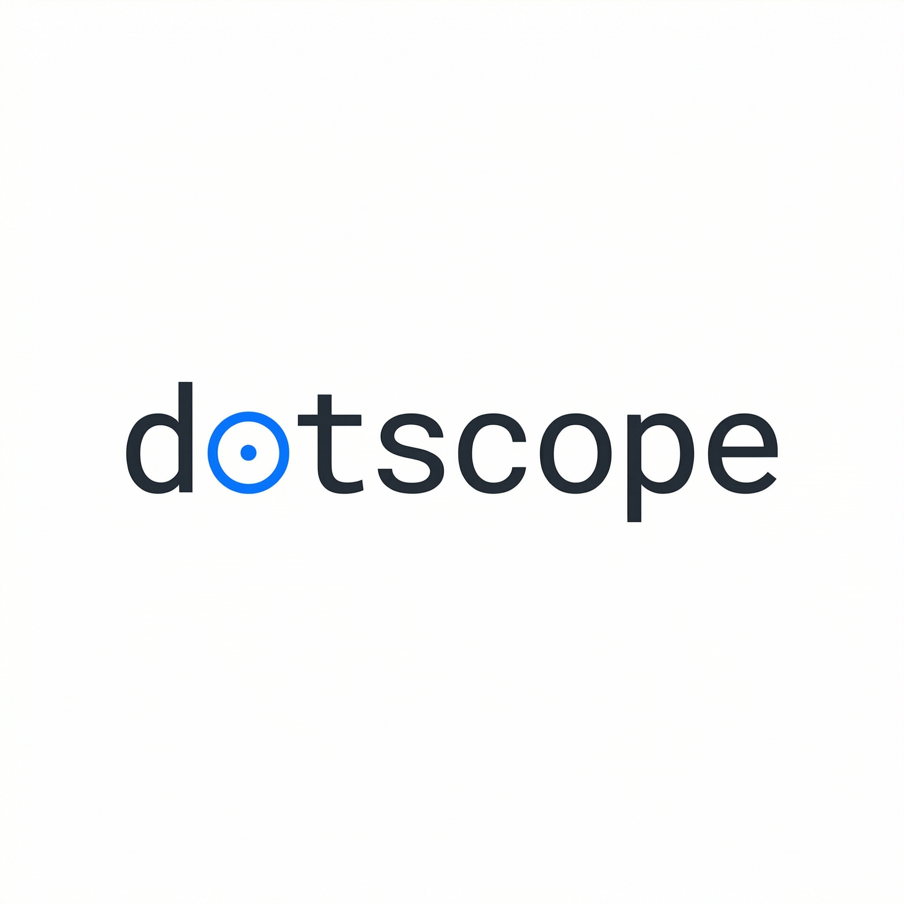

<p align="center">
  
</p>

# The Hardware-Accelerated Architectural Compiler

Your agent writes code that compiles, passes tests, and breaks production.
The agent sees files. You see architecture. **dotscope closes that gap.**

### The Open-Source Architectural Control Plane
Dotscope is a high-performance headless telemetry engine built natively around the standard Model Context Protocol (MCP). It operates silently in the background, mapping the topological physics of your codebase and transmitting golden templates to your AI agent of choice (Claude, Cursor, Windsurf, Cline).

```bash
pip install dotscope
dotscope serve --headless
```

---

### Strict Execution Taxonomy
Dotscope is engineered for uncompromising speed, operating strictly across decoupled bounds ensuring zero data drift between human CLI inputs and Agent MCP tool queries:

- **`<Engine>`**: Resolves abstract scope mathematics (e.g. `auth+payments-tests&api@context`) down to concrete file constraints with zero side effects.
- **`<Workflows>`**: Deploys multi-stage sequence migrations and automated ingest cycles that silently reverse-engineer architectural logic from raw Git history.
- **`<UX>`**: Formats headless semantic JSON outputs perfectly into FastMCP standard payloads and terminal outputs for instantaneous debugging scenarios.

```
$ dotscope ingest

  Analyzing dependency graph...
  Mining git history...
  Discovering conventions...

  Discoveries:
  - version.py and environment.prod.ts always change together
  - workflow-edit-dialog.component.ts and models.py are tightly coupled

  Validation (49 commits backtested):
  - Overall recall: 78%
  - Token reduction: 67% (1.3M → 437K avg)

  Output: 3 .scope files written.
```

One MCP tool call. The agent gets the relevant code, its dependency
neighborhood, implicit contracts from git history, convention rules,
swarm lock status, and action hints. One call, not five.

dotscope learns from every commit. Files agents consistently need get
ranked higher. Conventions that hold get enforced harder. Rules that
get overridden get quieter. Recall starts at 78% and climbs past 91%.

```bash
pip install dotscope && dotscope serve
```

Zero dependencies. Open Source. MIT.

[How It Works](docs/how-it-works.md) · [Scope Files](docs/scope-file.md) · [Agent Instructions](AGENT_INSTRUCTIONS.md) · [MIT](LICENSE)
